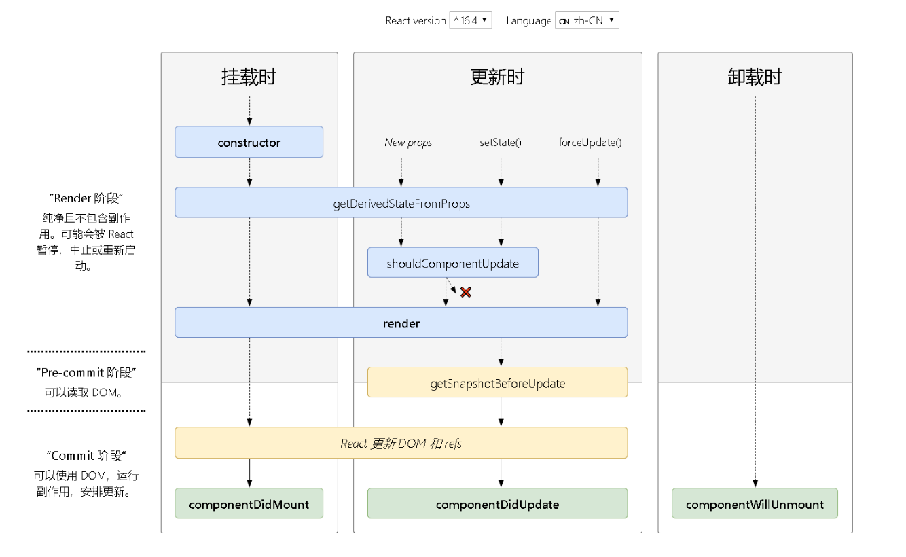
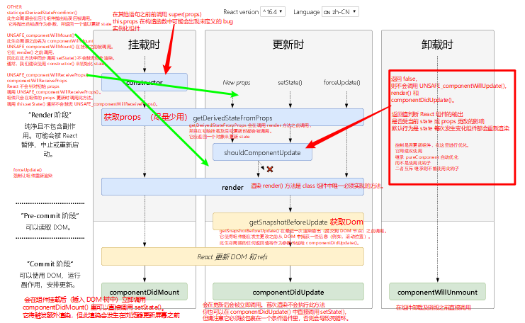

#  React Component &Life Cycle

> 相关链接
>
> - [React componet ](https://react-1251415695.cos-website.ap-chengdu.myqcloud.com/docs/react-component.html)


## Component

>  **组件名称必须以大写字母开头**
>
>  > 为啥了？小写字母开头的组件视为原生 DOM 标签
>
>  
>
>  React 的组件可以定义为 class 或函数的形式 即
>
>  react 组件有两种
>
>  - class类组件
>  - function 函数组件
>
>  定义组件最简单的方式就是编写 JavaScript 函数：
>
>  ```react
>  function Welcome(props) {
>    return <h1>Hello, {props.name}</h1>;
>  }
>  ```
>
>  > 它接收唯一带有数据的 “props”（代表属性）对象与并返回一个 React 元素。这类组件被称为“函数组件”，因为它本质上就是 JavaScript 函数
>
>  [ES6 的 class](https://developer.mozilla.org/en/docs/Web/JavaScript/Reference/Classes) 来定义组件
>
>  ```react
>  class Welcome extends React.Component {
>    render() {
>      return <h1>Hello, {this.props.name}</h1>;
>    }
>  }
>  ```

### Class Component

1. 定义 class 组件，需要继承 `React.Component`

2. 必须定义 [`render()`](https://react-1251415695.cos-website.ap-chengdu.myqcloud.com/docs/react-component.html#render) 函数

3. React 建议不要创建自己的组件基类,因为React [代码重用的主要方式是组合而不是继承](https://react-1251415695.cos-website.ap-chengdu.myqcloud.com/docs/composition-vs-inheritance.html)。

   

> 所以我们就不要捣鼓, 自己封装一个高级的组件类了
>
> 想办法造积木就好

```react
class Welcome extends React.Component {
  render() {
    return <h1>Hello, {this.props.name}				</h1>;
  }
}
```

不使用 ES6 的 class 语法。可以使用 `create-react-class` 模块或类似的自定义抽象来代替。

[not use es6](https://react-1251415695.cos-website.ap-chengdu.myqcloud.com/docs/react-without-es6.html)

举个栗子：

```react
var createReactClass = require('create-react-class');
var Greeting = createReactClass({
  render: function() {
    return <h1>Hello, {this.props.name}</h1>;
  }
});
```

4. 每个组件都包含“生命周期方法”，调用这些函数在特定的阶段执行这些方法 [生命周期图谱](http://projects.wojtekmaj.pl/react-lifecycle-methods-diagram/)

### Function Component


### 实例属性

#### [`props`](https://react-1251415695.cos-website.ap-chengdu.myqcloud.com/docs/components-and-props.html)

##### 是啥？

> 当 React 元素为用户自定义组件时，它会将 JSX 所接收的属性（attributes）转换为单个对象传递给组件，这个对象被称之为 “props”。
>
> 
>
> 我们定义组件 (标签) 需要给他几个属性（如：style,id..）
>
> JSX 会把标签的上的属性转化为对象（不是女朋友那种）
>
> 这个对象我们给他起个名字 -> `props`
>
> 我们每个组件 (标签)可以 接收到自己身上的属性，
>
> 这个`props` 放在组件的实例属性上 

Props 的只读性

**所有 React 组件都必须像纯函数一样保护它们的 props 不被更改。**

#### [`state`](https://react-1251415695.cos-website.ap-chengdu.myqcloud.com/docs/react-component.html#state)

组件中的 state 包含了随时可能发生变化的数据

如果某些值未用于渲染或数据流（例如，计时器 ID），则不必将其设置为 state。

永远不要直接改变 `this.state`，因为后续调用的 `setState()` 可能会替换掉你的改变。请把 `this.state` 看作是不可变的。

### class 属性

#### [`defaultProps`](https://react-1251415695.cos-website.ap-chengdu.myqcloud.com/docs/react-component.html#defaultprops)

场景：

-  Class 组件

- Class 组件的 props 未赋值，但又不能为 null 

  那么


 

```react
    class CustomButton extends 			React.Component {
      // ...
    }

    CustomButton.defaultProps = {
      color: 'blue'
    };


	  render() {
    	return <CustomButton /> ; // 		props.color 将设置为 'blue'
  		}

     render() {
        return <CustomButton color={null} /> ; // props.color 将保持是 null
      }
```

#### [`displayName`](https://react-1251415695.cos-website.ap-chengdu.myqcloud.com/docs/react-component.html#displayname)

场景：

`displayName` 字符串多用于调试消息

[使用 displayname 轻松进行调试](https://react-1251415695.cos-website.ap-chengdu.myqcloud.com/docs/higher-order-components.html#convention-wrap-the-display-name-for-easy-debugging)


###  API

#### [`setState()`](https://react-1251415695.cos-website.ap-chengdu.myqcloud.com/docs/react-component.html#setstate)

- [State 和生命周期指南](https://react-1251415695.cos-website.ap-chengdu.myqcloud.com/docs/state-and-lifecycle.html)
- [深入学习：何时以及为什么 `setState()` 会批量执行？](https://stackoverflow.com/a/48610973/458193)
- [深入：为什么不直接更新 `this.state`？](https://github.com/facebook/react/issues/11527#issuecomment-360199710)

##### 特性

> `setState()` 将对组件 state 的更改
>
> `setState()` 并不总是立即更新组件，批量推迟更新。setState()` 后立即读取 `this.state还是上次state 。可以使用。componentDidUpdate` 或者 `setState` 的回调函数`setState(updater, callback)`
>
> `setState()` 将始终执行重新渲染操作，除了`shouldComponentUpdate()` 返回 `false`  
>
> 

#####  Use


setState(updater[, callback])

栗子：

1. 使用函数式修改

```react
    this.setState((state, props) => {
      return {counter: state.counter + props.step};
    });
```

   2. setState()的第二个参数为可选的回调函数，它将在 setState 完成合并并重新渲染组件后执行。可以解决推迟更新。 建议使用 `componentDidUpdate()` 来代替此方式。

      

   3. `setState()` 的第一个参数除了接受函数外，还可以接受对象类型

      > ```react
      >     this.setState({quantity: 2})
      > ```


#### [`forceUpdate()`](https://react-1251415695.cos-website.ap-chengdu.myqcloud.com/docs/react-component.html#forceupdate)

component.forceUpdate(callback)

#### 场景

当组件的 state 或 props 发生变化时，组件将重新渲染。

如果 `render()` 方法依赖于其他数据，此时state 或 props 未发生变化。

此时我们就可以让forceUpdate() 闪亮登场

调用 `forceUpdate()` 强制让组件重新渲染

#### 注意

- 调用 `forceUpdate()` 将致使组件调用 `render()` 

- 会跳过该组件的 `shouldComponentUpdate()`

- 其子组件会触发正常的生命周期方法，包括 `shouldComponentUpdate()` 方法

  > 提示：
  >
  > 避免使用`forceUpdate()`，
  >
  > 尽量在 `render()` 中使用 `this.props` 和 `this.state`。


## 生命周期

### 图谱






###  生命周期各个阶段

#### 挂载

当组件实例被创建并插入 DOM 中时，其生命周期调用顺序： 

> 常用的生命周期方法会被加粗

- [**constructor()**](https://react-1251415695.cos-website.ap-chengdu.myqcloud.com/docs/react-component.html#constructor)
- [`static getDerivedStateFromProps()`](https://react-1251415695.cos-website.ap-chengdu.myqcloud.com/docs/react-component.html#static-getderivedstatefromprops)
- [**render()**](https://react-1251415695.cos-website.ap-chengdu.myqcloud.com/docs/react-component.html#render)
- [**componentDidMount()**](https://react-1251415695.cos-website.ap-chengdu.myqcloud.com/docs/react-component.html#componentdidmount)

即将过时的周期方法，在新代码中应该[避免使用它们](https://react-1251415695.cos-website.ap-chengdu.myqcloud.com/blog/2018/03/27/update-on-async-rendering.html)：

- [`UNSAFE_componentWillMount()`](https://react-1251415695.cos-website.ap-chengdu.myqcloud.com/docs/react-component.html#unsafe_componentwillmount)


#### 更新


- [`static getDerivedStateFromProps()`](https://react-1251415695.cos-website.ap-chengdu.myqcloud.com/docs/react-component.html#static-getderivedstatefromprops)
- [`shouldComponentUpdate()`](https://react-1251415695.cos-website.ap-chengdu.myqcloud.com/docs/react-component.html#shouldcomponentupdate)
- [**render()**](https://react-1251415695.cos-website.ap-chengdu.myqcloud.com/docs/react-component.html#render)
- [`getSnapshotBeforeUpdate()`](https://react-1251415695.cos-website.ap-chengdu.myqcloud.com/docs/react-component.html#getsnapshotbeforeupdate)
- [**componentDidUpdate()**](https://react-1251415695.cos-website.ap-chengdu.myqcloud.com/docs/react-component.html#componentdidupdate)

即将过时的周期方法

- [`UNSAFE_componentWillUpdate()`](https://react-1251415695.cos-website.ap-chengdu.myqcloud.com/docs/react-component.html#unsafe_componentwillupdate) 
- [`UNSAFE_componentWillReceiveProps()`](https://react-1251415695.cos-website.ap-chengdu.myqcloud.com/docs/react-component.html#unsafe_componentwillreceiveprops)

#### 卸载

当组件从 DOM 中移除时会调用如下方法：

- [**componentWillUnmount()**](https://react-1251415695.cos-website.ap-chengdu.myqcloud.com/docs/react-component.html#componentwillunmount)

#### 错误处理

当渲染过程，生命周期，或子组件的构造函数中抛出错误时，会调用如下方法：

- [`static getDerivedStateFromError()`](https://react-1251415695.cos-website.ap-chengdu.myqcloud.com/docs/react-component.html#static-getderivedstatefromerror)
- [`componentDidCatch()`](https://react-1251415695.cos-website.ap-chengdu.myqcloud.com/docs/react-component.html#componentdidcatch)


### 生命周期的异步渲染过程


> 异步渲染，现在渲染有两个阶段：`reconciliation` 和 `commit`

#### reconciliation 阶段

- `componentWillMount`

- `componentWillReceiveProps` 

  被替换成 `getDerivedStateFromProps`  该函数会在初始化和 `update` 时被调用

- `shouldComponentUpdate`

- `componentWillUpdate`

  被替换成 getSnapshotBeforeUpdate 该函数会在 `update` 后 DOM 更新前被调用，用于读取最新的 DOM 数据。

> 因为 Reconciliation 阶段是可以被打断的，所以 Reconciliation 阶段会执行的生命周期函数就可能会出现调用多次的情况，从而引起 Bug。由此对于 Reconciliation 阶段调用的几个函数，除了 `shouldComponentUpdate` 以外，其他都应该避免去使用

####  Commit 阶段

- `componentDidMount`
- `componentDidUpdate`
- `componentWillUnmount`


